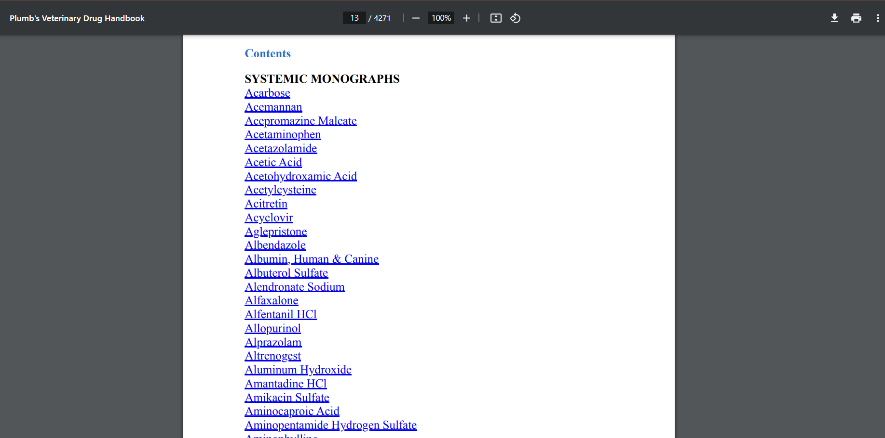
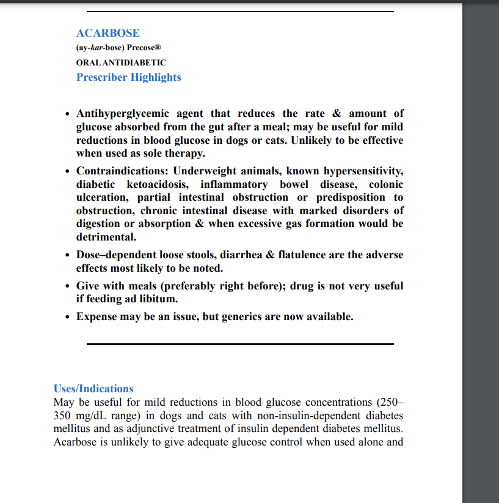
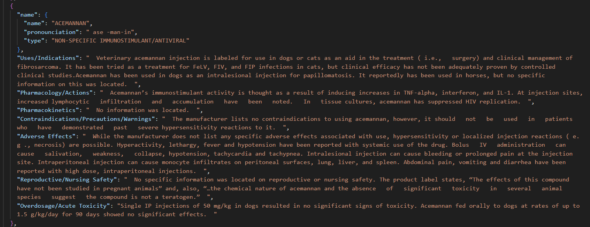
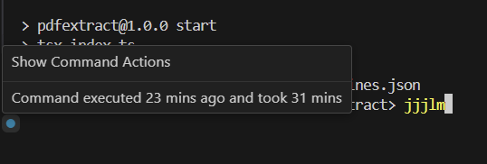

# PDF.js Text Extract (PawHaven)

## Overview

The goal of this project is to scrape through a pdf containing various veterinary drugs and output a .json file for convenient consumption. 

It's not perfect, some text but not all got overcaptured. But it is sufficient for my use case.

## Strategy

Utilizing PDF.js, along with Typescript, I set out to partition each medicine section based on the medicine list on the index page. From there, it's straightforward to find the page length of each medicine section based on each section's starting page differences.

Regular Expressions(regex) were heavily used to help me in finding the correct string I wanted.

## Example of pdf layout

- Index Page

- Page Layout

- JSON Object Output

- Script Duration

## Installation

1. Clone the repository: `git clone https://github.com/DanielMcFluffy/PDFTextExtract.git`
2. Navigate to the project directory: `cd repository`
3. Install dependencies: `npm install`
4. Run project: `npm start`

## Licence

MIT License

Copyright (c) [2024] [Daniel McFluffy]

Permission is hereby granted, free of charge, to any person obtaining a copy of this software and associated documentation files (the "Software"), to deal in the Software without restriction, including without limitation the rights to use, copy, modify, merge, publish, distribute, sublicense, and/or sell copies of the Software, and to permit persons to whom the Software is furnished to do so, subject to the following conditions:

The above copyright notice and this permission notice shall be included in all copies or substantial portions of the Software.

THE SOFTWARE IS PROVIDED "AS IS", WITHOUT WARRANTY OF ANY KIND, EXPRESS OR IMPLIED, INCLUDING BUT NOT LIMITED TO THE WARRANTIES OF MERCHANTABILITY, FITNESS FOR A PARTICULAR PURPOSE AND NONINFRINGEMENT. IN NO EVENT SHALL THE AUTHORS OR COPYRIGHT HOLDERS BE LIABLE FOR ANY CLAIM, DAMAGES OR OTHER LIABILITY, WHETHER IN AN ACTION OF CONTRACT, TORT OR OTHERWISE, ARISING FROM, OUT OF OR IN CONNECTION WITH THE SOFTWARE OR THE USE OR OTHER DEALINGS IN THE SOFTWARE.

